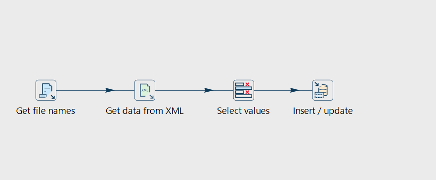
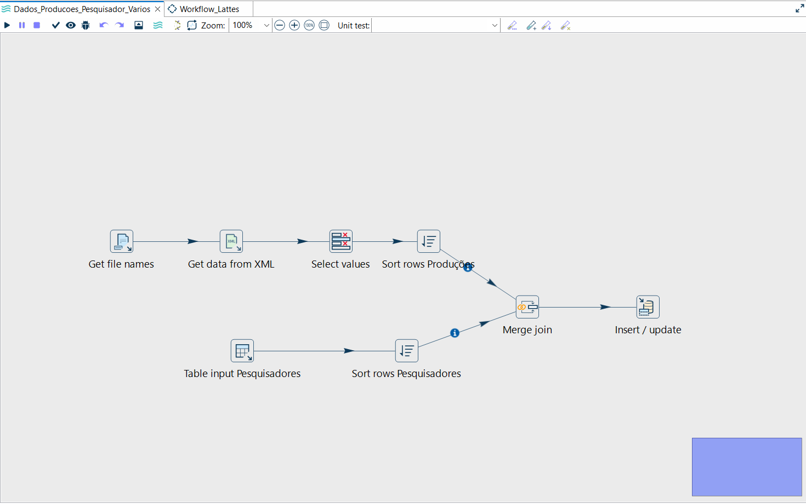

# 📊 Pipeline de Dados (ETL) com Apache Hop e Currículo Lattes

Este repositório contém um projeto prático de Engenharia de Dados que simula um processo completo de ETL (Extração, Transformação e Carga). O objetivo é extrair dados de produções acadêmicas de arquivos XML do Currículo Lattes, processá-los utilizando o **Apache Hop**, armazená-los em um banco de dados **PostgreSQL** e, por fim, criar um painel analítico no **Power BI**.

## 🛠️ Arquitetura e Tecnologias Utilizadas

- **Docker:** Conteinerização do banco de dados.
- **PostgreSQL:** Banco de dados relacional para armazenamento dos dados processados.
- **Apache Hop:** Orquestração e fluxos visuais de integração de dados (ETL).
- **Java 17 (JDK):** Pré-requisito para execução do ambiente do Apache Hop.
- **Power BI:** Criação de dashboards interativos para visualização dos dados.

---

## Infraestrutura e Banco de Dados (Docker)

O banco de dados PostgreSQL foi configurado para rodar de forma isolada em um contêiner Docker.

### Subindo o Banco de Dados

No terminal (com o Docker Desktop em execução), navegue até a raiz deste projeto e execute os seguintes comandos:

**Construir a imagem Docker e iniciar o container:**

```bash
docker build -t docker_simcc .
docker run -d --name docker_simcc -p 5437:5432 docker_simcc
```

### Criação das Tabelas

Com o contêiner rodando, conecte-se ao banco BD_PESQUISADOR (utilizando um cliente como HeidiSQL ou DBeaver) e execute as queries de criação do Schema (src/create_tables.sql):

```sql
-- Habilita a extensão para gerar UUIDs automaticamente
CREATE EXTENSION IF NOT EXISTS "uuid-ossp";

-- Cria a tabela de pesquisadores
CREATE TABLE IF NOT EXISTS pesquisadores (
    pesquisadores_id UUID NOT NULL DEFAULT uuid_generate_v4(),
    lattes_id VARCHAR(16) NOT NULL,
    nome VARCHAR(200) NOT NULL,
    PRIMARY KEY (pesquisadores_id)
);

-- Cria a tabela de produções associada ao pesquisador
CREATE TABLE IF NOT EXISTS producoes (
    producoes_id UUID NOT NULL DEFAULT uuid_generate_v4(),
    pesquisadores_id UUID NOT NULL,
    issn VARCHAR(16) NOT NULL,
    nomeArtigo TEXT NOT NULL,
    anoArtigo INTEGER NOT NULL,
    PRIMARY KEY (producoes_id),
    CONSTRAINT fkey FOREIGN KEY (pesquisadores_id)
    REFERENCES pesquisadores (pesquisadores_id) ON UPDATE NO ACTION ON DELETE NO ACTION
);
```

## Orquestração com Apache Hop

O fluxo de dados foi construído para ler os arquivos .xml localizados na pasta data, extrair os atributos específicos usando caminhos XPath e gravá-los no PostgreSQL.

Como Executar

- **Instale o Java JDK 17 e baixe o Apache Hop.**
- **Execute o arquivo hop-gui.bat (Windows) ou hop-gui.sh (Linux/Mac).**
- **No Apache Hop, adicione este diretório como um novo Projeto apontando para a pasta hop/lattes.**
- **Abra as pipelines .hpl ou o workflow principal .hwf localizados na pasta de metadados.**
- **Verifique a conexão com o banco de dados na aba Metadata e execute a pipeline.**

## Pipelines Apache HOP

| Pipeline                                 | Descrição                                                |
| ---------------------------------------- | -------------------------------------------------------- |
| `Dados_Pesquisador.hpl`                  | Extrai dados de um único XML do Lattes                   |
| `Dados_Pesquisador_Varios.hpl`           | Extrai dados de múltiplos XMLs                           |
| `Dados_Producoes_Pesquisador_Varios.hpl` | Extrai artigos indexados e carrega na tabela `producoes` |

### Pesquisadores



### Producoes



### Configuração da conexão no HOP

- **Connection type**: PostgreSQL
- **Host**: 127.0.0.1
- **Port**: 5437
- **Database**: BD_PESQUISADOR
- **Username**: postgres

## Resultado

Dashboard interativo no Power BI conectado diretamente ao PostgreSQL, com filtro de ano (2007–2024) e os seguintes visuais:


## 🔎 Busca Semântica Textual (Full Text Search)

WITH unaccent, portuguese_stem;

````

---

### 🔍 Exemplos de Busca

#### Busca simples
```sql
SELECT nomeartigo
FROM producoes
WHERE to_tsvector('pt_br', nomeartigo)
@@ to_tsquery('pt_br', 'dengue');
````

#### Busca combinada (AND)

```sql
SELECT nomeartigo
FROM producoes
WHERE to_tsvector('pt_br', nomeartigo)
@@ to_tsquery('pt_br', 'covid & bahia');
```
